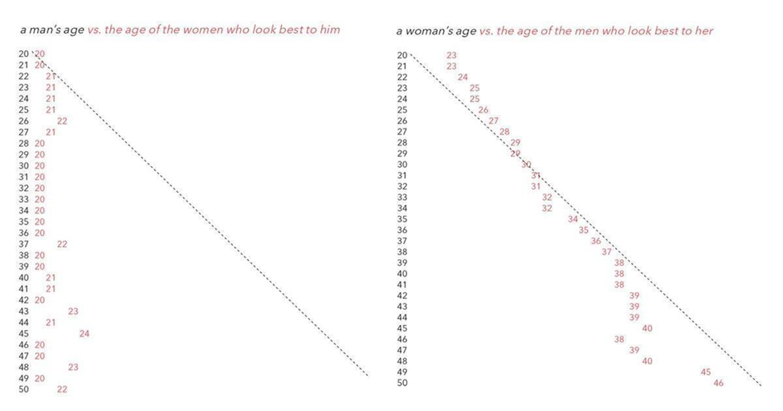

## **Lesson 1: Intro to DA**

### Machine Learning Types
- Unsupervised Learning : 
    + Dimensionality Reduction : 
        - Text mining 
        - Face recognigtion 
        - Big Data Visualization
        - Image recognition 
    + Clustering 

***
- Supervised Learning 
    + Classification : 
        - Fraud Detection 
        - Email spam detection
        - Diagnostics
        - Image classification
    + Regression : 
        - Risk assessments 
        - Price prediction 
***
- Reinforced Learning 

```
In supervised learning, the output is known . It means that you know what you want to see.
```

## **Lesson 2: Regression**

### **1. Definition**

Thuật toán Regression dùng để giải quyết các bài toán tìm y, mà y là một giá trị số thực dựa vào các dữ liệu đã có

ví dụ: dự đoán giá nhà dựa vào số phòng và diện tích, dự đoán huyết áp dựa vào lượng đường huyết và cân nặng , dự đoán giá xe dựa vào số năm đã sử dụng và số km đã đi, ... 

Các bước cơ bản để giải quyết bài toán:

- Xác định bài toán (output, benefit)  *Building model is not the end goal*
- Lấy dữ liệu và Data preprocessing (xử lý missing value, …)
- Exploratory data analysis (EDA)
- Feature Scaling 
- Split to train set and test set (train set 80%, test set 20%)
- Building and Training model
- Predicting the Test Results
- Evaluating the Model Performance

#### **1.1 Linear Regression**

> Là một thuật toán Regression đơn giản dùng để dự đoán một giá trị y dựa trên giá trị x đã có.
     
Linear Regression có dạng là một phương trình đường thẳng :
     
Y = ax + b ( với b là sai số , a là độ dốc , và x là giá trị đã biết , b là sai số )

=> Ta có 1 tập dữ liệu gồm n điểm, ta giả định có 1 mối quan hệ tương đối tuyến tính (linear) giữa biến x và y, bài toán là cần tìm đường thẳng nào mà đi sát nhất với tát cả n điểm dữ liệu đó

Lưu ý : Correlation & Causation. 



Outlier 


Loss function: 
Sẽ giải thích kĩ hơn ở phần sau của bài giảng. Xem phần cuối tài liệu này.
Multi Variate Linear Regression 

Tương tự như Linear Regression, Multi Variate Linear Regression là thuật toán Regression dùng để dự đoán một giá trị y dựa trên nhiều giá trị x, x1 , x2 đã có.

Ví dụ : Dự đoán giá nhà có x1 mét vuông , x2 phòng ngủ và khoảng cách đến trung tâm thành phố là x3. 

Y = a1x1 + a2x2 + a3x3 + ... + anxn + b 

Notes : Vì Multi Variate là có nhiều biến, nên đương nhiên hàm Y của chúng ta giờ đây sẽ có nhiều chiều , vì vậy không thể vẽ bằng 2D được nữa, nếu muốn vẽ tượng trưng bằng 2D, chúng ta phải tiến hành thu giảm chiều dữ liệu bằng những phương pháp như PCA, hay những phương pháp unsupervised khác. 

Lưu ý : Data normalization & Standardization


The two most discussed scaling methods are Normalization and Standardization. 

Normalization typically means rescales the values into a range of [0,1]. 
Standardization typically means rescales data to have a mean of 0 and a standard deviation of 1 (unit variance)

Feature Scaling : Đưa 2 biến có giá trị khác nhau về cùng 1 hệ quy chiếu . Ví dụ : Nhiệt độ (*C) và USD. Có thể thấy 30*C và 3,000,000 USD không cùng 1 hệ quy chiếu, nên nếu chúng ta vẽ, hoặc dự đoán mà không “scale” chúng về 1 hệ quy chiếu thì mô hình chúng ta sẽ có độ chính xác không cao.

Non Linear Regression 
Khái niệm :
Non Linear Regression là những thuật toán Regression dùng để dự đoán những bài toán mà Linear Regression không thể dự đoán được , hoặc dự đoán với kết quả chính xác rất thấp. Vì đồ thị hàm số y bây giờ không còn là một đường thẳng nữa ( Non Linear).

 Polynominal Regression
Khái niệm:
Polynominal Regression là Regression với đường thẳng bây giờ là ở dạng y = a*x^n + b 

Thực hành : Google Colab Link


Model Evaluation 
Đánh giá : Overfit & Underfit 

Nguồn : Machine Learning cơ bản , Vũ Hữu Tiệp

Mô hình tốt : Mô hình chạy và cho kết quả khá khớp ở cả 2 bộ dữ liệu huấn luyện & test
Mô hình quá khớp ( overfit) : Mô hình chạy và cho kết quả quá khớp ở bộ dữ liệu huấn luyện, nhưng lại không tốt ở bộ dữ liệu test.
Mô hình chưa khớp ( underfit): Mô hình chạy và cho kết quả không khớp ở cả 2 bộ dữ liệu train & test.


Mean Absolute Error

là trung bình của giá trị tuyệt đối các sai số,  dùng để đo lường sự khác biệt giữa hai biến dự đoán và biến thật. 
Mean Square Error
là trung bình của bình phương các sai số, tức là sự khác biệt giữa các ước lượng và những gì được đánh giá , nó càng dần về 0 thì càng có đủ độ tin cậy chứng tỏ mô hình ít bị sai số nhất

Ngoài ra còn có RMSE là căn bậc 2 của MSE 

